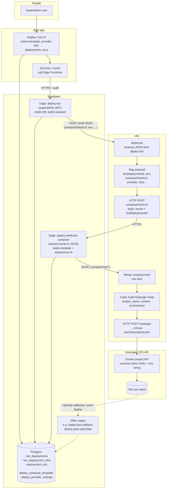

# Deploy architecture (app → Supabase → n8n → Hostinger)

**Rendered diagram:** open [`deploy-architecture-flow.html`](./deploy-architecture-flow.html) in your **browser** (double-click the file in your file manager, or right-click → Open with). The `.md` file below keeps the same chart as Mermaid source for GitHub and editors that preview Mermaid.

High-level flow: superadmin configures data in the app (Postgres); **deploy-bot** Edge reads the DB and POSTs a small payload to **n8n**; n8n fetches full **compose YAML** from **deploy-webhook-compose**; n8n POSTs **inline** compose + env text to **Hostinger**’s Docker API.

For step-by-step n8n nodes and secrets, see [DEPLOY_WORKFLOW.md](./DEPLOY_WORKFLOW.md).
